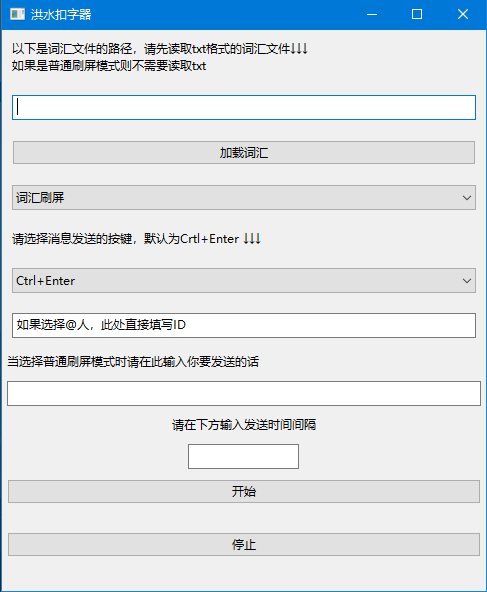

# Flood-message-sender
可以发送洪水一样的消息，也可以导入词汇进行扣字
# 👽宇宙安全声明
* 仅供交流学习，切勿用于骚扰他人，后果自负
# 🤔怎么使用？
## 我是小白↓
## 看这里的0iq使用教程↓
* 下载release中的Download_Me.exe和Words.txt，这两个分别是主程序和词汇
* 如果下载好以后运行Download_Me.exe可以看到以下界面，说明运行成功

## 特别注意！！！😟
* release里面打包的程序有时候会让360报毒，我目前没有解决办法  

* python程序打包成exe多半会这样，添加信任就好
* 我绝对保证软件是无毒且无后门的！（毕竟哥们源码都放在这里了好吧，没必要门你的）
## 我是大蛇，我害怕被门↓
## 看这里的编译教程↓
* 下载main.py，弄到pycharm里面，导入必要的库即可运行
* 然后可以用pyinstaller打包成exe（360会给你的exe报毒别问我为什么💩）
* 你需要的库有wxpython，keyboard，pyperclip，这几个库是需要你手动下载的
* wxpython是用来写GUI的，keyboard是模拟按键，pyperclip用来复制文本
